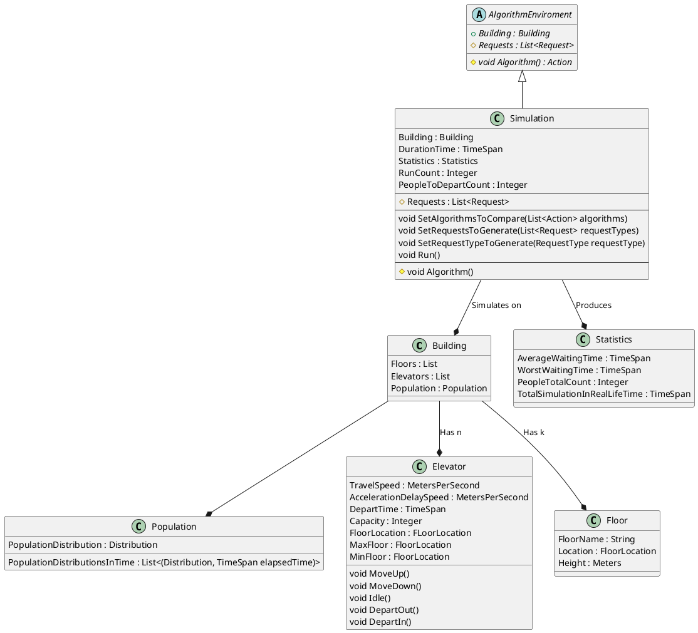
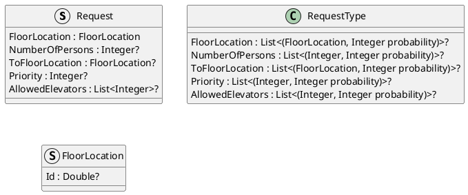

# Elevator System optimization - Library
# Introduction 
Imagine we want to construct a building and we want to design an elevator
system for it. How can we do it, so the elevator system is the most efficient one
for this specific building? We run simulations of different elevator systems and
different algorithms, compare them and pick the best one. This is what this
program is about.

This library will help client to setup an elevator system for a building, specify some general algorithm that the library provides (SCAN, First comes first served, etc ...) or write completely his own and run simulations on it. The simulation gathers statistical data that can be used to compare different algorithms efficiency. Clients can also tweak simulations parameters and can provide differnt population distributions of their buildings.

In summary, this tool helps clients design optimal elevator system for any building.

## Model
### Building
* Represents a real life building with floors, elevators system and population
* List of floors is ordered by their FloorId
* Two floors next to each other in the list has also their Ids different by one
    * Thanks to this, it is easy to calcuate floor's distances and elevator's and floor's distances.
    * It's just their Id's difference ()
* Simulations will be run on this

### Elevator
* TravelSpeed is a speed of the elevator. How long does it take the elevator to go from floor A to floor B is calculated from it's speed and from proper floor's height.

* AccelerationDelaySpeed represents Speed of the elevator from standing position (last action was Idle() or DepartXXX()) or when it changed direction (eg last action was MoveUp() and current action is MoveDown()).
    * Time of travel from floor A to floor B is calculated the same way as for TravelSpeed.

* DepartTIme represent time for departing people. Either Coming off the elevator or coming in the elevator.
* Capacity stand for the maximum number of people that are allowed in the elevator.

* FloorLocation is an identification of where the elevator is. Note that the Id is double. The reson for that is, that elevator can be between two floors. That can happen if some elevators have different speeds.
    * If that's the case, calculating elevator's distance from some floor A is still just the difference of their Id's.

* Set of possible actions - move up/down, stay and do nothing or depart in/out.

* MaxFloor and MinFloor give a range of possible floors the elevator can operate on. Sometimes, elevators cannot go pass certain floors and are therefore conceived to only some portion of building's floors.
    * If both null, there is no limitation.

### Floor
* Represents one floor in the building.
* Is locaten by unique identifier.
* FloorName can be used for rendering or generally for a better display name.

### Statistics
* From these statistics the quality of each algoritm is deduced. 

* AverageWaitingTime represents waiting time of each request
    * It's calculated dynamically
    * Waiting time of one request is calculated as differnce of it's CreatedDateTime and first DepartureIn handling this request

* Worst waiting time stands for the longest time some request waited for being handled

* PeopleTotalCount is the total count of people handled during some predefined time.

* TotalSimulationInRealLifeTime represents the total time simulation took mapped to real life time.

### Simulation
* Runs the discrete simulation of given algorithms on a given building
* Produces statistics for each algorithm
* One step of simulation is moving elevators to a position (floor or in between floors), where at least one elevator is fully on one floor (eg e1 is on f1 and e2 is on f3 - one step - e1 is on f2 e2 is on f3.5, that means e1 was currently faster and is fully on a floor)

* DurationTime represents how much time should the simulation simulate (eg 1 day, or just a noon / afternoon ... ).
    * When in simulation time is greater than DurationTime, simulation terminates.

* PeopleToDepartCount dictates how many people should be departed. When in simulation people departed count is greater, simulation terminates.
    * If set, takes precedence over DurationTime.

* RunCount dictates how many times is each algorithms run. If more than once, resulting statistics are then averaged from each independent run.

* SetAlgorithmsToCompare() sets the algorithms on which the simulation will run and which will be compared to each other.

* SetRequestsToGenerate() indicates the possible requests types. The simulation's internal request generator will genearte only these request. 

* SetRequestTypeToGenerate()
    * Provides a RequestType. All generated requests will be in it's range and generate with given probabilities.
    * This is very handy, because this way, it is very easy to specify concrete elevator systems (such as if our elevator system supports whether it could know where the user wants to go before he departs etc ...)
    * And because we know what elevator system we have at our disposal, algorithms passed to the simulation doesn't have to check for every possible request option and can anticipate what kind of request it might get

* Run() runs the simulation
    * Building and DurationTime or PeopleToDepartCount must be set, otherwise exception is thrown

* Algorithm() is protected and overrired from parent. Each algorithm passed to SetAlgorithmsToCompare() will be assigned to this ALgorithm as a delegate.
    * Simulation calls this Algorithm class internally to decide from elevator's positions, requests and population predictions how to plan each elevator's action
    * This Algorithm method is the main logic of the whole algorithm
    * Simulation only takes care of managing request and the underlying discrete simulation
    * Algorithm is called in each step of the simulation

* Requests are used internally
    * Input to Algorithm() with building

### AlgorithmEnviroment
* Client will inherit from this class and implement his custom algorithm as Algorithm()
* Then pass this method as a delegate to the simulation using SetAlgorithmsToCompare()
* For each new algorithm, define new class - AlgorithmHandler

### Population
* Population is crucial for generating people - requests
* PopulationDistribution specifies a Distribution that will hold for the entire run of the simulation (eg Poission, Uniform, or some custom)

* PopulationDistributionInTime describes different distributions in time
    * It might be wiser to simulate only time intervals for concrete distributions instead of mixing several distributions together

## Static architecture - API

## Data
### Request
* request represents clicking the elevator call button, or register of employees ID card, etc ...

* FloorLocation stand for the floor location where the request happened.
    * Even though Id is double, for request only Integer values make sense (Request cannot happen in between two floors).
    * Floor location is the only required field, others are optional (more on why is this way in Simulation chapter).

* NumberOfPersons describes how many people are tied to this request.
    * For example, if employee calls elevator using his ID card, elevator system can have some more information about the employee at it's disposible. Such as, how many people are potentially with him.
        * Usually one ID to one person is waiting mapping makes the most sense
    * Without the ID card, one press of the elevator call button doesn't mean anything. One person can press the call button how many times he likes.

* ToFloorLocation maps to a floor where the person would like to go. In more sophisticated elevator systems, there is a possibility for users to specify where they would like to go even before some elevator departs.
    * If null, elevator system cannot know where the user would like to go beforehand.

* Priority specifies the importance of given request. This covers situation where eg a VIP person calls an elevator (using his ID to verify it's really him)
    * The higher the number, the higher the priority

* AllowedElevators are elevators that can depart person / persons making this request. From real life, person requesting the elevator might have some disability or he and some other people transport a very heavy load. And not all elevators support this.
    * If null, all elevators are allowed.

### RequestType
* Specifies a set of requests.
* To each concrete value is assign a probability of it's occurence
* Probabilities in each field's list must add to one, otherwise exception is thrown
* If some property is not set, all possible options are allowed with uniform probabilities

### FloorLocation
* Note that the Id is double.
    * Elevator can be in between floors (see Elevators section).
    * eg Id=3.5 means the elevator is exactly between floor with Id=3 and floor with Id=4

# Logic of the simulation
Simulation object will run underlying discrete event simulation on the building with given algorithms for either a given time or given total of people to depart.
Simulation object will manage request queue, steps, statistics and time (which can also be considered as a statistic). In each step of the discrete event simulation, simulation object will call some Algorithm method given by a client from given Algorithms list.
This method is the main logic of the whole simulation and it decides how the elevators move in each step based on:
1. Elevator's positions
1. Requests
1. Possibly population predictions

## Step
One step of the simulation is moving of elevator's (or staying) according to their action (move up/down, idle, depart in/out).
The moving stops when at least one elevator is fully on some floor.
Because elevators can have different speeds, it's possible that other elevators are inbetween floors.
The exact Id on Elevator.FloorLocation is calculated from elevator's speed, appropriate floor's height and elapsed time from the previous step.
After each step, simulation increases it's internal time property by the duration of the step.
Not only time is updated, also all statistics properties are updated too. Also, in each step Alogrithm() is called.

## Requests
Requests can be of many types depending on what properties are set and how they are set. What requests will be internally generated in simulation object is defined by SetRequestsToGenerate or SetRequestTypeToGenerate methods. This information is very useful for Algorithm(). The implementation can vary heavily on the type of requests that are being used. Hence both Algorithm() and types of requests that are generated by simulation are both defined by client, it's his responsibility to glue these two concepts together.

## Time
Simulation tracks it's time duration, that represents time for how long what was simulated will take in real world.
It's tracked in seconds.
It does it by incrementing it in each step by step's duration.
Step's duration is calculated by the time it took some of the elevator's that is fully on a floor to travel from here from the previous step.
That is calculated from elevator's speed property and appropriate floor's height property.
At the end of the simulation, it is converted to TimeSpan.

## Population
Population is generated based on given distribution / distributions.
Nothing stops client to develop more sophisticated Algorithm() method that can also decide based on population distribution and "predict" where people / requests could occur more likely and for example keep elevators always close to this area.

# Why this approach
I believe this gives client a great deal of flexibility on how to implement the main logic.
This library will of course provide some sample Algorithm() function implementations.
This approach also ensure loose coupling, where data model is decoupled from simulation's logic, which mainly comes from request type and Algorithm.
Also, the simulation provides all the functionality that client doesn't and shouldn't care about, such as managing the simulation.
Thanks to this desing, it's also easy to extend many of the objects properties and methods, even the most crucial ones, such as elevator and request.

# Advanced concept from C#
I will use parallel programming for running the simulation. I can run simulation with different Algorithm methods in parallel, because they are completely independent of each other. It could potentially make the simulation run faster.

I would also like to use some serialization techniques. I assume that generics or linq would also come in handy.
