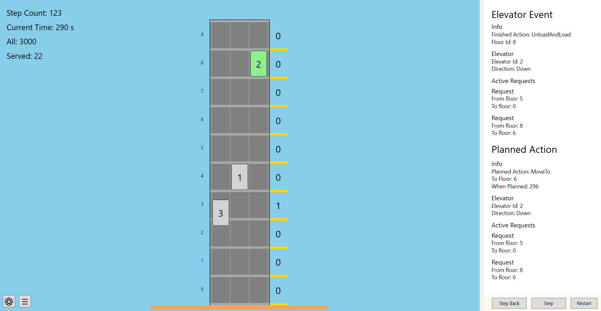
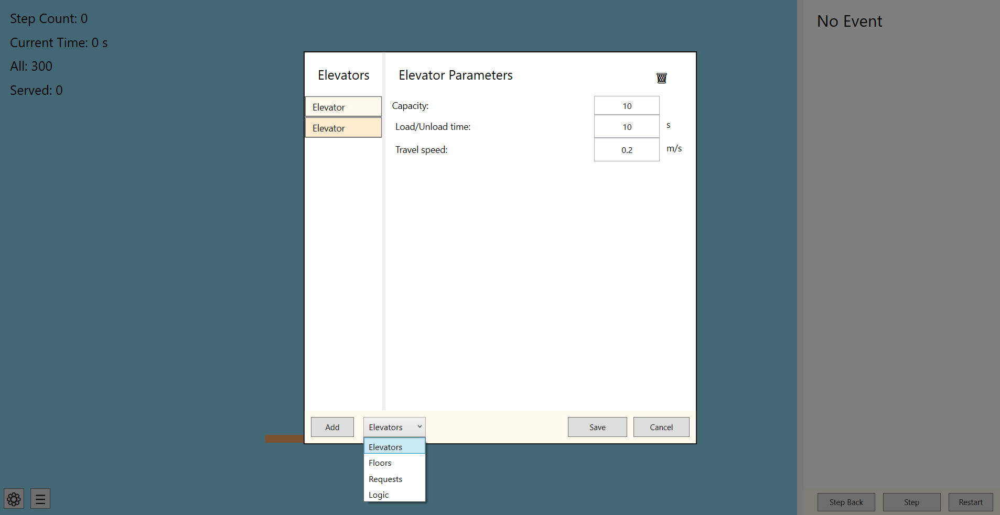
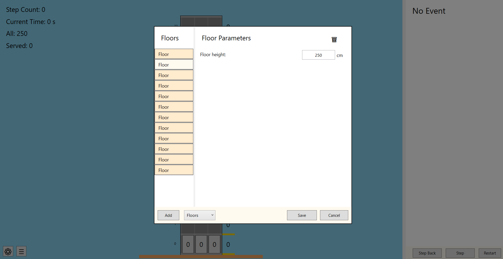
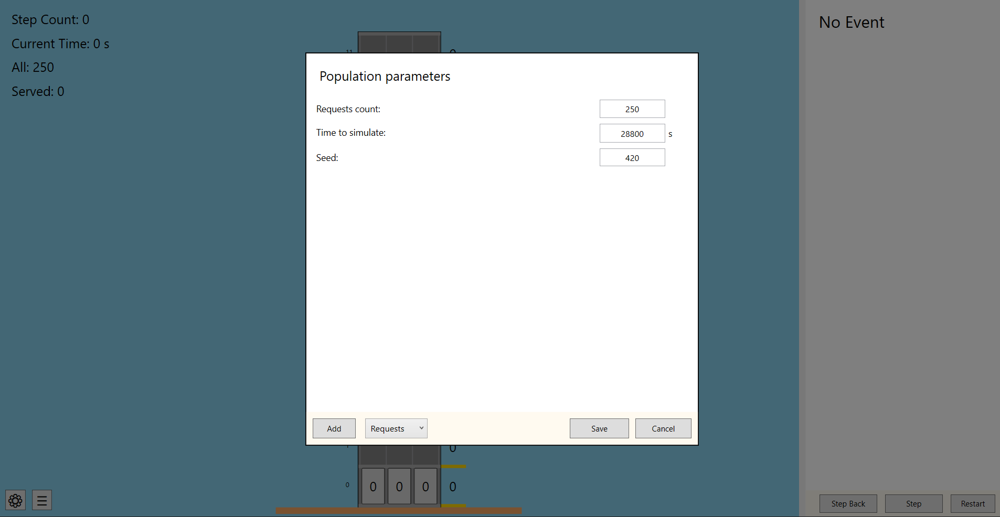
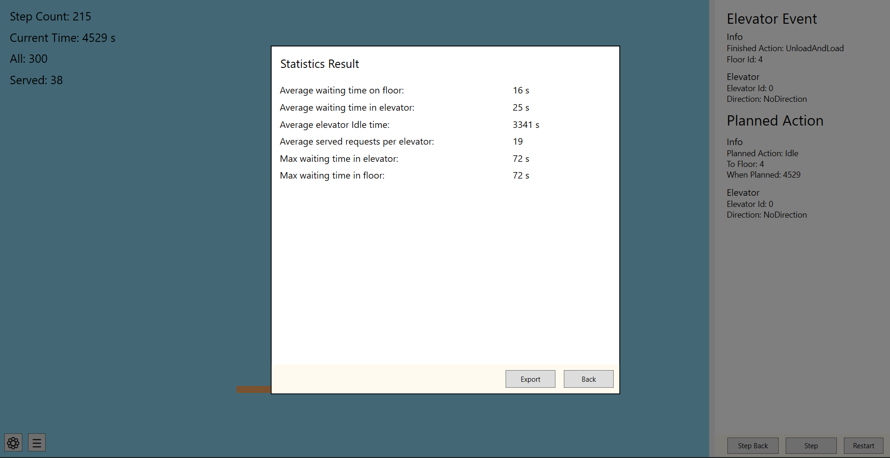
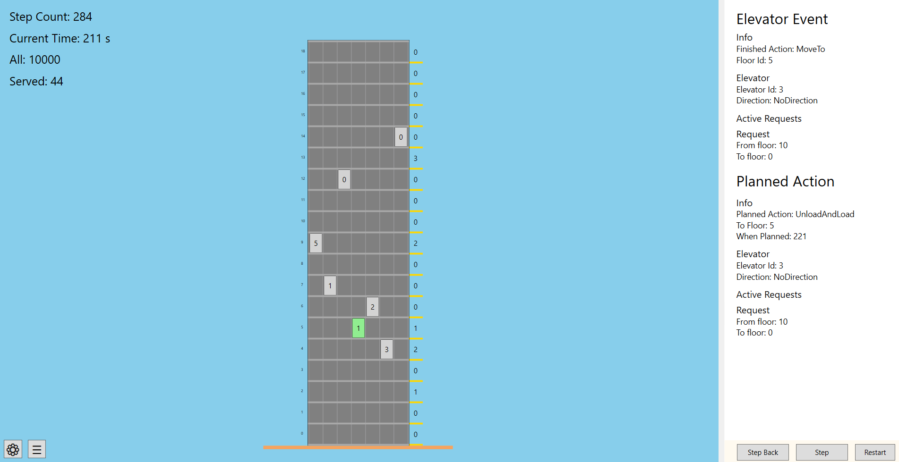

# **Elevator System optimization**
# Introduction 
Imagine we want to construct a building and we want to design an elevator
system for it. How can we do it, so the elevator system is the most efficient one
for this specific building? We run simulations of different elevator systems and
different algorithms, compare them and pick the best one. This is what this
program is about.

This library will help client to setup an elevator system for a building, specify some general algorithm that the library provides (SCAN, First comes first served, etc ...) or write completely his own and run simulations on it. The simulation gathers statistical data that can be used to compare different algorithms efficiency. Clients can also tweak simulations parameters and can provide differnt population distributions of their buildings.

In summary, this tool helps clients design optimal elevator system for any building.

# How to use
 

## The right side panel
* Press Step button to step forward in the simulation
* Press Step Back button to step backwards in the simulation
* Press Restart button to restart the simulation

### Request Event / Elevator Event
* Represents current event which occured
* Either an elevator event
    * Elevator has arrived to a floor
    * Elevator Loads / Unloads people
* Or a request event
    * Request has occured on some floor
    * This would in real life correspond for example to a button being pressed

### Planned Action
* Represents what the current elevator system (algorithm) chosed to do after this specific request happened
* Situation in the screenshot is:
   * Current event is Elevator Event
      * Elevator `2` finished unloading and loading people in floor `8`
      * We can also see some additional information about the elevator
   * Planned action after current event, which was decided by current algorithm (SCAN in this case), is to move this elevator to floor `6`
      * The reason is, that we can see there are 2 requests in elevator `2`, one of which wants to go to floor `6`. Since floor `6` is closer than floor `5` (desired destination of the other request).

## Left upper corner 
* Represents current state of the simulation
* Step Count represents current step in the simulation
* Current Time represents how much seconds elapsed from start of the simulation
* All represents number of all requests
* Served represents number of already served requests
    * Served request is a request which was handled by some elevator

## Building in the middle
* Represent the building on which the simulation is run, with elevators moving around 
* The numbers on the right side represent number of requests in each floor
* Number in the elevator represents number of requests in the elevator

## Buttons in the bottom left corner
* Settings button opens Menu
* Stats button opens Statistics

## Remarks
* The current event is visually marked green for easier understanding of what is currently happening

---

## Menu
* Screenshot shows Elevators tab. There is also Floors tab, Population tab and Elevator algorithm tab.
* In each of these tabs you can modify corresponding part of the simulation

 

### Elevators tab
* You can add and remove elevators
* You can specify capacity, load / unload time and travel speed for each elevator

 

### Floors tab
* You can add and remove floors
* You can specify height of each floor

 

### Population tab
* You can choose number of requests and time span in which it is generated
* You can choose seed for generation, to exactly reproduce simulations

 

## Statistics
* At any given time throughout the simulation, you can see real time statistics of the simulation, such as average waiting time of people on floor or in elevator, maximum waiting times and many more.
* You can also export the statistics, for later use, such as comparing them with other models
* In the exported version, you can find much more detailed statistics, such as statistics for each and every elevator and requests

# Remarks

 

* As described above, there is a lot of things you can as a user adjust
* With this great flexibility, you can test out many different elevator algorithms with many different elevator systems working on a big variety of buildings handling great amount of different population distributions 
* This software is mainly distributed as fully functional package, but it is build on the core logic, which is `Simulation` project under this solution
* Feel free to extend this library with your own elevator algorithms, functionality and whatever idea you would have in a separate fork
* You can ask for a pull request and if I find your contribution useful, I would definitely be open to add your contribution to this project

# How to run
* Clone this repository (`git clone https://github.com/TomasTillmann/ElevatorSystemSimulation.git`) or manually download whole folder
* Install latest [Visual Studio](https://visualstudio.microsoft.com/downloads/), open `ElevatorSystemSimulation.sln` solution, right click the solution in the solution explorer and click `build`.
* After few seconds, you will find the executable in a `bin` folder in the project's folder

# **Main idea**
Imagine we want to construct a building and we want to design an elevator system for it. How can we do it, so the elevator system is the most efficient one for this specific building? We run simulations of different elevator systems and different algorithms, compare them and pick the best one. This is what this program is about.

## Problem
Imagine a building with an elevator system. How should the elevator system work to be the most efficient one? What is the best elevator system strategy for this concrete building?

Before we dive into these questions, we need to start with what an elevator system actually is. 
Elevator system consists of elevators, each having some parameters (speed, capacity, ...) and possible actions (move up, move down, stay, open doors, ...).
Elevator system is controlled by strategy (SCAN, first comes first served, ...). This strategy is what we would like to optimize. 

Thus we want to find the best way how should an elevator system behave.
Elevator system makes it's decisions based on these information:

* on what floors are requests
* what floors must each elevator visit
* where each elevator is

These are also information that every elevator system needs to have at it's disposal, otherwise it could only operate randomly.
Just having these information as input is sufficient for developing some more sophisticated strategy, but there are other information, that an elevator system can have access to:

**Current situation information**:

* how many people each elevator has
* how many people in elevator want to go to each floor
* how many people requesting for elevator is on each floor
* how many people is in the building

**Population predictions**:

* how likely a request appears at some floor (can change over time)
* how likely a person from floor A would like to go to floor B (can change over time)

If elevator system has some of these (or possibly some different) information at his disposal, his strategy can be much more sophisticated and has potential to operate much better. Note, that information, that each elevator needs to have at it's disposal are of course **Current situation information**.

How likely a request appears at some floor changes over time. For example in up peak period, it is very likely that requests occur in ground floor. In down peak period, most of the requests would appear in higher floors.
Similiarly, for how likely a person would like to go from floor A to a different floor B. In up peak, persons from ground floor would probably like to go to their offices, let's say floors 5 to 10 and during down peak period, they would like to go from their offices to ground floor.

What information elevator system has depends on how sophisticated it is.
Some elevator systems for example have the abilitiy to know how many people is in the building, each floor, or in each elevator, because elevator users have some sort of identification card with which they request the elevator.

Some other systems have the ability to know how many people in elevator want to go to each floor, because when user calls for the elevator, he doesn't just press a button, but also configures on a display where would he like to go.

There is many different elevator systems with different information at their disposal. It is safe to say, that elevator systems with more available information have the biggest potential to be the most optimal, but we might not always have the financial needs for the best elevator systems. Sometimes, we would like to find the most optimal strategy for some not so sophisticated elevator systems.

Consequently, there is also a handful of metrics against we can measure how some strategy is succesful. Some very reasonable metrics are average waiting time for an elevator, average waiting time in an elevator, worst-case waiting time or even some average of all of these metrics combined ...

So now we know what problem we want to solve. We want to find the best strategy for some elevator system or more elevator systems with different available information about the enviroment. How good a strategy is could be predefined by some metrics.

## Formalization of the problem 
### Input
* Buildig $B = (F, E_s)$
    * $F \subseteq \mathbb{Z}$, floors 
    * $E_s = (E, C)$, elevator system
    * $E$ is set of elevators
        * $e \in E:$ $e = (e_A, e_P)$
            * $e_A$ are elevator's possible actions
            * $e_P$ are elevator's parameters
    * $C$, current situation information that elevator system can obtain from the enviroment 
* $P_B$, population predictions for $B$
* Metrics $M$ that define how succesful strategy is

### Output
* find the most optimal strategy $s$ for given building $B$ against given metrics $M$

## My approach
Let there be some efficiency function $q_M: q_M(s, B) \rightarrow [0,1]$, obeying given metrics $M$.
This efficiency function takes strategy $s$ and building $B$ and rates it by number from 0 to 1. The bigger the number, the more $s$ is optimal for elevator system $E$ in $B$.

If we have $q_M$ and some set of strategies $S_{strategies}$, we can very easily find 

$$
s_{optimal} : q_M(s_{optimal},B) = max(\{q_M(s, B) | \forall s \in S_{strategies}\})
$$

that is the most optimal.

Obtaining some $S_{strategies}$ isn't very difficult. It can be for example a set of some well-known scheduling algorithms, such as SCAN, First comes first served, priority scheduling, round robin scheduling, ...
Set $S_{strategies}$ could also potentially contain some user defined algorithms or some algorithms developed specificaly for $B$ (for example by some genetic algorithm,...).

It is much harder to obtain $q_M$, which is right now the only missing piece needed for solving the problem. 

I want $q_M$ to run a discrete simulation. 

## Discrete Simulation
Efficiency function $q_M$ will run discrete event simulation using next-event progression paradigm. 

The simulation schedules events. Events are:

1. Move elevator to the current floor 
2. Move elevator to the floor above
3. Move elevator to the floor beyond
4. Board people to elevator
5. Spawn people to floors

Each event takes some time. For example, time of moving an elevator to the floor above or beyond can be calculated from elevator's speed and height of rooms, it can also be an elevator's parameter ($\in e_P$).

Boarding time can also be an elevator's parameter ($\in e_P$). Interval between spawning people and potentially some other could be set before the simulation start. 

This time, after picking up the event from scheduler's queue is of course added to the total time $t$. Time $t$ represent total running time of the simulation.

Each of these events is then scheduled by scheduler at the appropriately calculated time.
What the next scheduled event is going to be is determined by some logic, depending on what event exactly is being scheduled. If the event regards elevators, next event is determined by current situation context and by the strategy $s$. If the event regards enviroment, such as spawning people, the decision is based on $P$ and $t$.

So what is being simulated is the enviroment (where people spawn, how many, where people want to go, ...), this affects the current situation context, and elevators (where to move in each step of the simulation, boarding, ...) and this is what $s$ wants to optimize.

Now we have to measure how well are elevators operating under control of given strategy $s$, in order to measure how good the strategy is.
What is beining measured is called statistics. What exactly statistics are depends on given metric $M$. 

After the simulation is terminated (either if $t$ is too big or by some other condition), quality of the strategy will be based on collected statistics.

# Why this approach
I believe this gives client a great deal of flexibility on how to implement the main logic.
This library will of course provide some sample Algorithm() function implementations.
This approach also ensure loose coupling, where data model is decoupled from simulation's logic, which mainly comes from request type and Algorithm.
Also, the simulation provides all the functionality that client doesn't and shouldn't care about, such as managing the simulation.
Thanks to this desing, it's also easy to extend many of the objects properties and methods, even the most crucial ones, such as elevator and request.

---

# School
As this project is largely done due to my studies at University, I would like to add some addition information from this perspective

## Advanced concept from C#
I will use parallel programming for running the simulation. I can run simulation with different Algorithm methods in parallel, because they are completely independent of each other. It could potentially make the simulation run faster.

I would also like to use some serialization techniques. I assume that generics or linq would also come in handy.

# Major updates of this documentation - log 
* 23.01.2023 - upload
